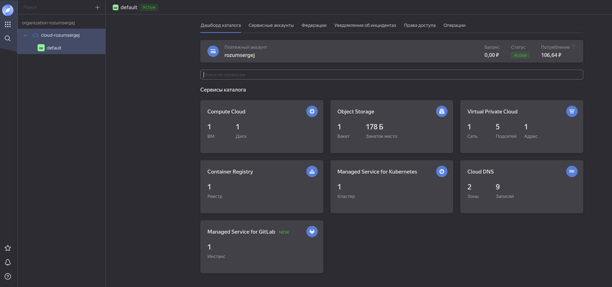
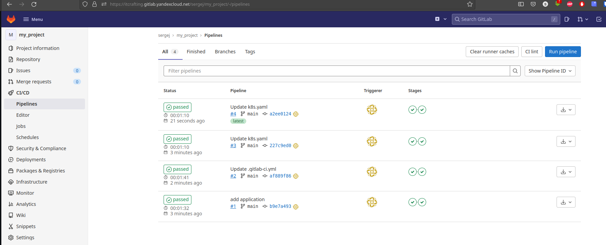
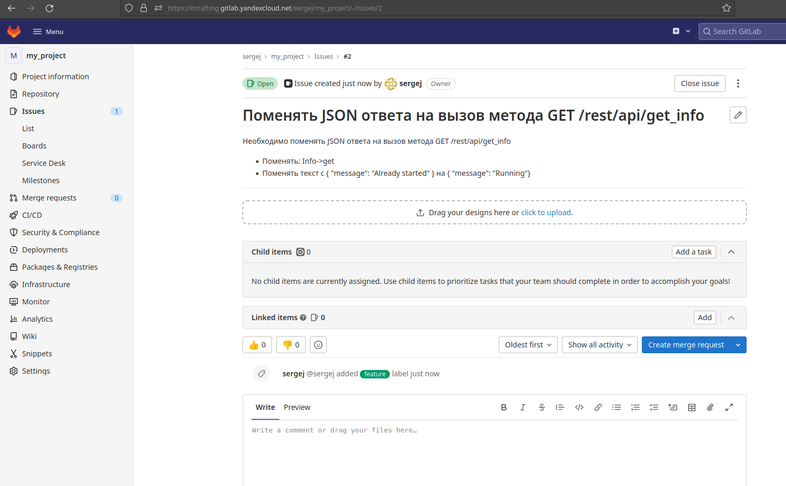
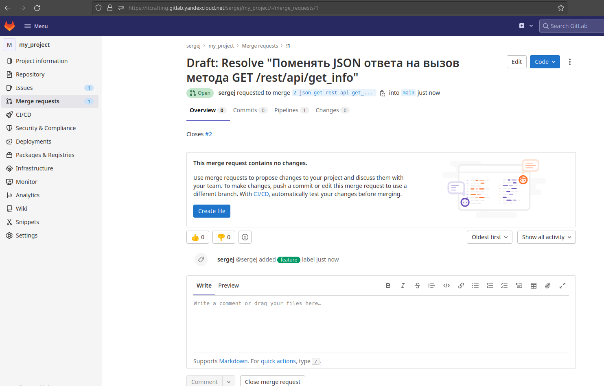
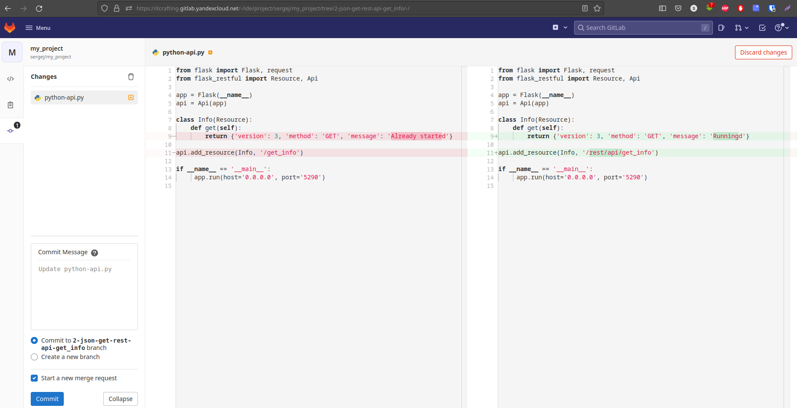
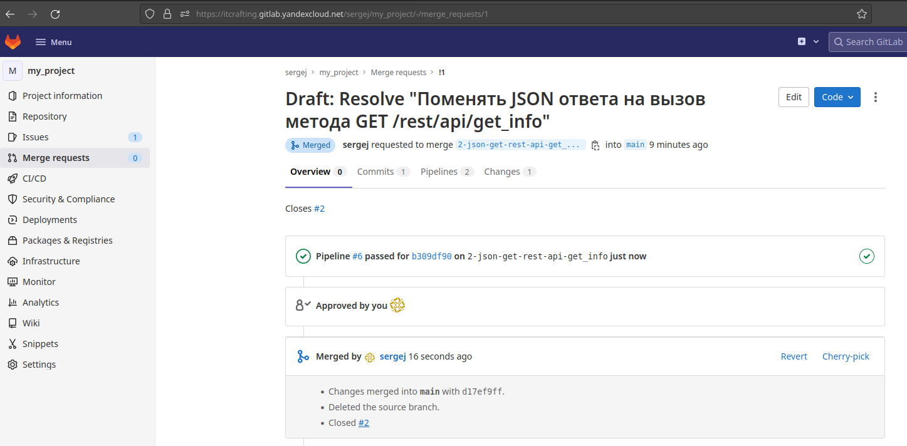

# Домашнее задание к занятию "09.06 Gitlab"

## Подготовка к выполнению

1. Необходимо [подготовить gitlab к работе по инструкции](https://cloud.yandex.ru/docs/tutorials/infrastructure-management/gitlab-containers)
2. Создайте свой новый проект
3. Создайте новый репозиторий в gitlab, наполните его [файлами](./repository)
4. Проект должен быть публичным, остальные настройки по желанию

## Основная часть

### DevOps

В репозитории содержится код проекта на python. Проект - RESTful API сервис. Ваша задача автоматизировать сборку образа с выполнением python-скрипта:
1. Образ собирается на основе [centos:7](https://hub.docker.com/_/centos?tab=tags&page=1&ordering=last_updated)
2. Python версии не ниже 3.7
3. Установлены зависимости: `flask` `flask-jsonpify` `flask-restful`
4. Создана директория `/python_api`
5. Скрипт из репозитория размещён в /python_api
6. Точка вызова: запуск скрипта
7. Если сборка происходит на ветке `master`: должен подняться pod kubernetes на основе образа `python-api`, иначе этот шаг нужно пропустить


- [.gitlab-ci.yml](./src/gitlab-ci.yml)
- [k8s.yaml](./src/k8s.yaml)
- [Dockerfile](./src/Dockerfile)

<details><summary>Консоль YandexCloud</summary>



</details>
<details><summary>Успешное выполнение pipeline</summary>



</details>

### Product Owner

Вашему проекту нужна бизнесовая доработка: необходимо поменять JSON ответа на вызов метода GET `/rest/api/get_info`, необходимо создать Issue в котором указать:
1. Какой метод необходимо исправить
2. Текст с `{ "message": "Already started" }` на `{ "message": "Running"}`
3. Issue поставить label: feature

<details><summary>Скриншот с Issue</summary>



</details>

### Developer

Вам пришел новый Issue на доработку, вам необходимо:
1. Создать отдельную ветку, связанную с этим issue
2. Внести изменения по тексту из задания
3. Подготовить Merge Requst, влить необходимые изменения в `master`, проверить, что сборка прошла успешно

<details><summary>Merge Request с успешной сборкой</summary>





</details>

### Tester

Разработчики выполнили новый Issue, необходимо проверить валидность изменений:
1. Поднять докер-контейнер с образом `python-api:latest` и проверить возврат метода на корректность
```json
   $ curl localhost:5290/rest/api/get_info
   {'version': 3, 'method': 'GET', 'message': 'Running'}
```
2. Закрыть Issue с комментарием об успешности прохождения, указав желаемый результат и фактически достигнутый

   > issue закрывается при мерже связанного merge request

## Итог

После успешного прохождения всех ролей - отправьте ссылку на ваш проект в гитлаб, как решение домашнего задания

[Ссылка на githab](https://itcrafting.gitlab.yandexcloud.net/sergej/my_project)


